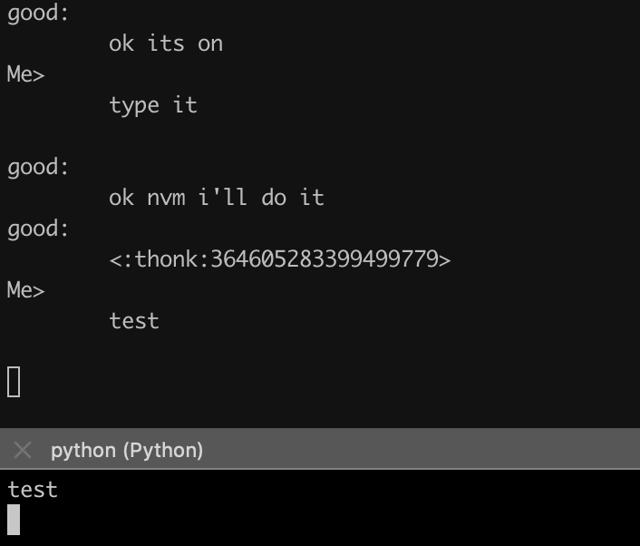

# discord-shenanigans
Starting out will probably just be a bridge between discord and probably terminal

##Setup
```
pip install -r requirements.txt
```
You can either export your Discord Webhook URL and Discord Bot Token to
DISCORD_WEBHOOK_URL and DISCORD_TOKEN respectively, or edit server.py to set it.


##To Use

Run the server/client scripts
```
# First you have to run the server
python server.py
# Then run client in a separate window/pane/tab
python client.py
```

You can override the default host IP and port by adding them to the end of the file name:
```
python server.py 1.1.1.1 1111
python client.py 1.1.1.1 1111
```

Type into the client to send messages, and keep the server open to keep
track of messages from both sources. <br>

Sample setup:


##Notes
The webhook will send blank embeds with each message. This is something
from discord's webhook internal workings. It cannot be turned off.<br>

I decided to use webhooks because I didn't want to hurt my brain too much with
async and multithreading. I'll probably dig into it later and try to get it
all working through the bot, but this works for now.<br>
